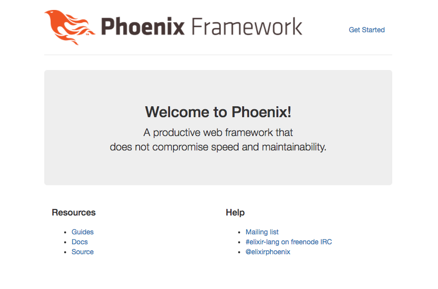

# Up and Running

The aim of this first guide is to get a Phoenix application up and running as quickly as possible.

Before we begin, please take a minute to read the [Installation Guide](installation.html). By installing any necessary dependencies beforehand, we'll be able to get our application up and running smoothly.

At this point, we should have Elixir, Erlang, Hex, and the Phoenix archive installed. We should also have PostgreSQL and node.js installed to build a default application.

Ok, we're ready to go!

We can run `mix phx.new` from any directory in order to bootstrap our Phoenix application. Phoenix will accept either an absolute or relative path for the directory of our new project. Assuming that the name of our application is `hello`, let's run the following command:

```console
$ mix phx.new hello
```

> A note about [Brunch.io](http://brunch.io/) before we begin: Phoenix will use Brunch.io for asset management by default. Brunch.io's dependencies are installed via the node package manager, not mix. Phoenix will prompt us to install them at the end of the `mix phx.new` task. If we say "no" at that point, and if we don't install those dependencies later with `npm install`, our application will raise errors when we try to start it, and our assets may not load properly. If we don't want to use Brunch.io at all, we can simply pass `--no-brunch` to `mix phx.new`.

> A note about [Ecto](https://hexdocs.pm/phoenix/ecto.html): Ecto allows our Phoenix application to communicate with a data store, such as PostgreSQL or MongoDB. If our application will not require this component we can skip this dependency by passing the `--no-ecto` flag to the `mix phx.new`. This flag may also be combined with `--no-brunch` to create a skeleton application.


```console
mix phx.new hello
* creating hello/config/config.exs
* creating hello/config/dev.exs
* creating hello/config/prod.exs
...
* creating hello/lib/hello_web/views/layout_view.ex
* creating hello/lib/hello_web/views/page_view.ex

Fetch and install dependencies? [Yn]
```

Phoenix generates the directory structure and all the files we will need for our application. When it's done, it will ask us if we want it to install our dependencies for us. Let's say yes to that.

```console
Fetch and install dependencies? [Yn] Y
* running mix deps.get
* running mix deps.compile
* running cd assets && npm install && node node_modules/brunch/bin/brunch build

We are all set! Go into your application by running:

    $ cd hello

Then configure your database in config/dev.exs and run:

    $ mix ecto.create

Start your Phoenix app with:

    $ mix phx.server

You can also run your app inside IEx (Interactive Elixir) as:

    $ iex -S mix phx.server
```

Once our dependencies are installed, the task will prompt us to change into our project directory and start our application.

Phoenix assumes that our PostgreSQL database will have a `postgres` user account with the correct permissions and a password of "postgres". If that isn't the case, please see the instructions for the [ecto.create](phoenix_mix_tasks.html#ecto-specific-mix-tasks) mix task.

Ok, let's give it a try. First, we'll `cd` into the `hello/` directory we've just created:

    $ cd hello

Now we'll create our database:

```
$ mix ecto.create
The database for Hello.Repo has been created
```

> Note: if this is the first time you are running this command, Phoenix may also ask to install Rebar. Go ahead with the installation as Rebar is used to build Erlang packages.

And finally, we'll start the Phoenix server:

```console
$ mix phx.server
[info] Running HelloWeb.Endpoint with Cowboy using http://0.0.0.0:4000
19:30:43 - info: compiled 6 files into 2 files, copied 3 in 2.1 sec
```

If we choose not to have Phoenix install our dependencies when we generate a new application, the `phx.new` task will prompt us to take the necessary steps when we do want to install them.

```console
Fetch and install dependencies? [Yn] n

We are almost there! The following steps are missing:

    $ cd hello
    $ mix deps.get
    $ cd assets && npm install && node node_modules/brunch/bin/brunch build

Then configure your database in config/dev.exs and run:

    $ mix ecto.create

Start your Phoenix app with:

    $ mix phx.server

You can also run your app inside IEx (Interactive Elixir) as:

    $ iex -S mix phx.server
```

By default Phoenix accepts requests on port 4000. If we point our favorite web browser at [http://localhost:4000](http://localhost:4000), we should see the Phoenix Framework welcome page.



If your screen looks like the image above, congratulations! You now have a working Phoenix application. In case you can't see the page above, try accessing it via [http://127.0.0.1:4000](http://127.0.0.1:4000) and later make sure your OS has defined "localhost" as "127.0.0.1".

Locally, our application is running in an `iex` session. To stop it, we hit `ctrl-c` twice, just as we would to stop `iex` normally.

[The next step](http://www.phoenixframework.org/docs/adding-pages) is customizing our application just a bit to give us a sense of how a Phoenix app is put together.
