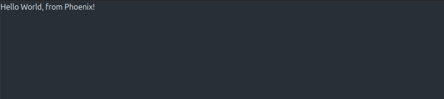

# Request life-cycle

> **Requirement**: This guide expects that you have gone through the [introductory guides](installation.html) and got a Phoenix application [up and running](up_and_running.html).

The goal of this guide is to talk about Phoenix's request life-cycle. This guide will take a practical approach where we will learn by doing: we will add two new pages to our Phoenix project and comment on how the pieces fit together along the way.

Let's get on with our first new Phoenix page!

## Adding a new page

When your browser accesses [http://localhost:4000/](http://localhost:4000/), it sends an HTTP request to whatever service is running on that address, in this case our Phoenix application. The HTTP request is made of a verb and a path. For example, the following browser requests translate into:

| Browser address bar                 | Verb | Path          |
|:------------------------------------|:-----|:--------------|
| <http://localhost:4000/>            | GET  | /             |
| <http://localhost:4000/hello>       | GET  | /hello        |
| <http://localhost:4000/hello/world> | GET  | /hello/world  |

There are other HTTP verbs. For example, submitting a form typically uses the POST verb.

Web applications typically handle requests by mapping each verb/path pair onto a specific part of your application. In Phoenix, this mapping is done by the router. For example, we may map "/articles" to a portion of our application that shows all articles. Therefore, to add a new page, our first task is to add a new route.

### A new route

The router maps unique HTTP verb/path pairs to controller/action pairs which will handle them. Controllers in Phoenix are simply Elixir modules. Actions are functions that are defined within these controllers.

Phoenix generates a router file for us in new applications at `lib/hello_web/router.ex`. This is where we will be working for this section.

The route for our "Welcome to Phoenix!" page from the previous [Up And Running Guide](up_and_running.html) looks like this:

```elixir
get "/", PageController, :home
```

Let's digest what this route is telling us. Visiting [http://localhost:4000/](http://localhost:4000/) issues an HTTP `GET` request to the root path. All requests like this will be handled by the `home/2` function in the `HelloWeb.PageController` module defined in `lib/hello_web/controllers/page_controller.ex`.

The page we are going to build will say "Hello World, from Phoenix!" when we point our browser to [http://localhost:4000/hello](http://localhost:4000/hello).

The first thing we need to do is to create the page route for a new page. Let's open up `lib/hello_web/router.ex` in a text editor. For a brand new application, it looks like this:

```elixir
defmodule HelloWeb.Router do
  use HelloWeb, :router

  pipeline :browser do
    plug :accepts, ["html"]
    plug :fetch_session
    plug :fetch_live_flash
    plug :put_root_layout, html: {HelloWeb.Layouts, :root}
    plug :protect_from_forgery
    plug :put_secure_browser_headers
  end

  pipeline :api do
    plug :accepts, ["json"]
  end

  scope "/", HelloWeb do
    pipe_through :browser

    get "/", PageController, :home
  end

  # Other scopes may use custom stacks.
  # scope "/api", HelloWeb do
  #   pipe_through :api
  # end

  # ...
end
```

For now, we'll ignore the pipelines and the use of `scope` here and just focus on adding a route. We will discuss those in the [Routing guide](routing.html).

Let's add a new route to the router that maps a `GET` request for `/hello` to the `index` action of a soon-to-be-created `HelloWeb.HelloController` inside the `scope "/" do` block of the router:

```elixir
scope "/", HelloWeb do
  pipe_through :browser

  get "/", PageController, :home
  get "/hello", HelloController, :index
end
```

### A new controller

Controllers are Elixir modules, and actions are Elixir functions defined in them. The purpose of actions is to gather the data and perform the tasks needed for rendering. Our route specifies that we need a `HelloWeb.HelloController` module with an `index/2` function.

To make the `index` action happen, let's create a new `lib/hello_web/controllers/hello_controller.ex` file, and make it look like the following:

```elixir
defmodule HelloWeb.HelloController do
  use HelloWeb, :controller

  def index(conn, _params) do
    render(conn, :index)
  end
end
```

We'll save a discussion of `use HelloWeb, :controller` for the [Controllers guide](controllers.html). For now, let's focus on the `index` action.

All controller actions take two arguments. The first is `conn`, a struct which holds a ton of data about the request. The second is `params`, which are the request parameters. Here, we are not using `params`, and we avoid compiler warnings by prefixing it with `_`.

The core of this action is `render(conn, :index)`. It tells Phoenix to render the `index` template. The modules responsible for rendering are called views. By default, Phoenix views are named after the controller (`HelloController`) and format (`HTML` in this case), so Phoenix is expecting a `HelloWeb.HelloHTML` module to exist and define an `index/1` function.

### A new view

Phoenix views act as the presentation layer. For example, we expect the output of rendering `index` to be a complete HTML page. To make our lives easier, we often use templates for creating those HTML pages.

Let's create a new view. Create `lib/hello_web/controllers/hello_html.ex` and make it look like this:

```elixir
defmodule HelloWeb.HelloHTML do
  use HelloWeb, :html
end
```

To add templates to this view, we can define them as functions in the module or in separate files.

Let's start by defining a function:

```elixir
defmodule HelloWeb.HelloHTML do
  use HelloWeb, :html

  def index(assigns) do
    ~H"""
    Hello!
    """
  end
end
```

We defined a function that receives `assigns` as arguments and used [the `~H` sigil](https://hexdocs.pm/phoenix_live_view/Phoenix.Component.html#sigil_H/2) to specify the content we want to render. Inside the `~H` sigil, we used a templating language called HEEx, which stands for "HTML+EEx". `EEx` is a library for embedding Elixir that ships as part of Elixir itself. "HTML+EEx" is a Phoenix extension of EEx that is HTML aware, with support for HTML validation, components, and automatic escaping of values. The latter protects you from security vulnerabilities like Cross-Site Scripting with no extra work on your part. We say that any function that receives `assigns` and returns templates to be a **function component**.

A template file works in the same way. Let's give it a try by defining a template in its own file. First, delete our `def index(assigns)` function from above and replace it with an `embed_templates` declaration:

```elixir
defmodule HelloWeb.HelloHTML do
  use HelloWeb, :html

  embed_templates "hello_html/*"
end
```

Here we are saying we want to embed all `.heex` templates found in the sibling `hello_html` directory into our module as function components.

Next, we need to add files to the `lib/hello_web/controllers/hello_html` directory. A template file has the following structure: `NAME.FORMAT.TEMPLATING_LANGUAGE`. In our case, let's create an `index.html.heex` file at `lib/hello_web/controllers/hello_html/index.html.heex`:

```heex
<section>
  <h2>Hello World, from Phoenix!</h2>
</section>
```

Phoenix will see the template file and compile it into an `index(assigns)` function, similar as before. There is no runtime or performance difference between the two styles.

Also note the controller name (`HelloController`) and the view name (`HelloHTML`) and their respective files, `hello_controller.ex` and `hello_html.ex` all follow the same naming convention, and are named after each other. You could name the directory anything you want, as long as you update the `embed_templates` setting accordingly, but it's best to follow conventions.

```console
lib/hello_web
├── controllers
│   ├── hello_controller.ex
│   ├── hello_html.ex
│   ├── hello_html
|       ├── index.html.heex   (NEW FILE!)
```

Now that we've got the route, controller, view, and template, we should be able to point our browser at [http://localhost:4000/hello](http://localhost:4000/hello) and see our greeting from Phoenix!

<picture>
  <source media="(prefers-color-scheme: dark)" srcset="assets/images/hello-from-phoenix-dark.png" />
  <source media="(prefers-color-scheme: light)" srcset="assets/images/hello-from-phoenix.png" />
  
</picture>

In case you stopped the server along the way, the task to restart it is `mix phx.server`. If you didn't stop it, everything should update on the fly: Phoenix has hot code reloading!

## Layouts

Even though our `index.html.heex` file consists of only a single `section` tag, the page we get is a full HTML document. Our index template is actually rendered into a separate layout: `lib/hello_web/components/layouts/root.html.heex`, which contains the basic HTML skeleton of the page. If you open this file, you'll see a line that looks like this at the bottom:

```heex
{@inner_content}
```

This line injects our template into the layout before the HTML is sent off to the browser. The root layout, as the name implies, is a barebone layout with mostly the `<head>` tag and a structure that is shared across **all of your pages**. Richer features, such as sidebar, menus, etc. are part of your application layout, which we will explore in a couple sections below.

## From endpoint to views

Having built our first page, we're beginning to understand how the request life-cycle is put together. Now let's take a more holistic look at it.

All HTTP requests start in our application endpoint. You can find it as a module named `HelloWeb.Endpoint` in `lib/hello_web/endpoint.ex`. Once you open up the endpoint file, you will see that, similar to the router, the endpoint has many calls to `plug`. `Plug` is a library and a specification for stitching web applications together. It is an essential part of how Phoenix handles requests and we will discuss it in detail in the [Plug guide](plug.html) coming next.

For now, it suffices to say that each plug defines a slice of request processing. In the endpoint you will find a skeleton roughly like this:

```elixir
defmodule HelloWeb.Endpoint do
  use Phoenix.Endpoint, otp_app: :hello

  plug Plug.Static, ...
  plug Plug.RequestId
  plug Plug.Telemetry, ...
  plug Plug.Parsers, ...
  plug Plug.MethodOverride
  plug Plug.Head
  plug Plug.Session, ...
  plug HelloWeb.Router
end
```

Each of these plugs have a specific responsibility that we will learn later. The last plug is precisely the `HelloWeb.Router` module. This allows the endpoint to delegate all further request processing to the router. As we now know, its main responsibility is to map verb/path pairs to controllers. The controller then tells a view to render a template.

At this moment, you may be thinking this can be a lot of steps to simply render a page. However, as our application grows in complexity, we will see that each layer serves a distinct purpose:

  * endpoint (`Phoenix.Endpoint`) - the endpoint contains the common and initial path that all requests go through. If you want something to happen on all requests, it goes in the endpoint.

  * router (`Phoenix.Router`) - the router is responsible for dispatching verb/path pairs to controllers. The router also allows us to scope functionality. For example, some pages in your application may require user authentication, others may not.

  * controller (`Phoenix.Controller`) - the job of the controller is to retrieve request information, talk to your business domain, and prepare data for the presentation layer.

  * view - the view handles the structured data from the controller and converts it to a presentation to be shown to users. Views are often named after the content format they are rendering.

Let's do a quick recap on how the last three components work together by adding another page. This time, we will use some additional features, such as layout components and content interpolation.

## Another new page

Let's add just a little complexity to our application. We're going to add a new page that will recognize a piece of the URL, label it as a "messenger" and pass it through the controller into the template so our messenger can say hello.

As we did last time, the first thing we'll do is create a new route.

### Another new route

For this exercise, we're going to reuse `HelloController` created at the [previous step](request_lifecycle.html#a-new-controller) and add a new `show` action. We'll add a line just below our last route, like this:

```elixir
scope "/", HelloWeb do
  pipe_through :browser

  get "/", PageController, :home
  get "/hello", HelloController, :index
  get "/hello/:messenger", HelloController, :show
end
```

Notice that we use the `:messenger` syntax in the path. Phoenix will take whatever value that appears in that position in the URL and convert it into a parameter. For example, if we point the browser at: `http://localhost:4000/hello/Frank`, the value of `"messenger"` will be `"Frank"`.

### Another new action

Requests to our new route will be handled by the `HelloWeb.HelloController` `show` action. We already have the controller at `lib/hello_web/controllers/hello_controller.ex`, so all we need to do is edit that controller and add a `show` action to it. This time, we'll need to extract the messenger from the parameters so that we can pass it (the messenger) to the template. To do that, we add this show function to the controller:

```elixir
def show(conn, %{"messenger" => messenger}) do
  render(conn, :show, messenger: messenger)
end
```

Within the body of the `show` action, we also pass a third argument to the render function, a key-value pair where `:messenger` is the key, and the `messenger` variable is passed as the value.

If the body of the action needs access to the full map of parameters bound to the `params` variable, in addition to the bound messenger variable, we could define `show/2` like this:

```elixir
def show(conn, %{"messenger" => messenger} = params) do
  ...
end
```

It's good to remember that the keys of the `params` map will always be strings, and that the equals sign does not represent assignment, but is instead a [pattern match](https://hexdocs.pm/elixir/pattern-matching.html) assertion.

### Another new template

For the last piece of this puzzle, we'll need a new template. Since it is for the `show` action of `HelloController`, it will go into the `lib/hello_web/controllers/hello_html` directory and be called `show.html.heex`. It will look surprisingly like our `index.html.heex` template, except that we will need to display the name of our messenger. Let's write the new template down and then explain what it does:

```heex
<Layouts.app flash={@flash}>
  <section>
    <h2>Hello World, from {@messenger}!</h2>
  </section>
</Layouts.app>
```

If you point your browser to [http://localhost:4000/hello/Frank](http://localhost:4000/hello/Frank), you should see a page that looks like this:

<picture>
  <source media="(prefers-color-scheme: dark)" srcset="assets/images/hello-world-from-frank-dark.png" />
  <source media="(prefers-color-scheme: light)" srcset="assets/images/hello-world-from-frank.png" />
  
</picture>

Let's break what the template does into parts. This template has the `.heex` extension which stands for HTML + Embedded Elixir. There are three features from HEEx we are using in the template above:

  * Assigns, such as `@messenger` and `@flash` - values we pass to the view from the controller are collectively called our "assigns". We could access our messenger value via `assigns.messenger` and `assigns.flash`, but Phoenix gives us the much cleaner `@` syntax for use in templates.

  * Content interpolation, such as `{@messenger}` - any Elixir code that goes between `{...}` will be executed, and the resulting value will replace the tag in the HTML output

  * Function component tags, as in `<Layouts.app>` - the reason templates are called function components is because we can compose them! In this case, there is an `HelloWeb.Layouts.app` function, that defines our application layout, which we invoke with our custom content

Also note how these three features compose: we are passing the `@flash` assign as an Elixir value to the `<Layouts.app>` component. As we will learn later, flash messages are used to display temporary messages to the user, such as success or error messages. We will learn more about them in the [Components and HEEx templates](components.html) guide.

We are done! Feel free to play around a bit. Whatever you put after `/hello/` will appear on the page as your messenger.
